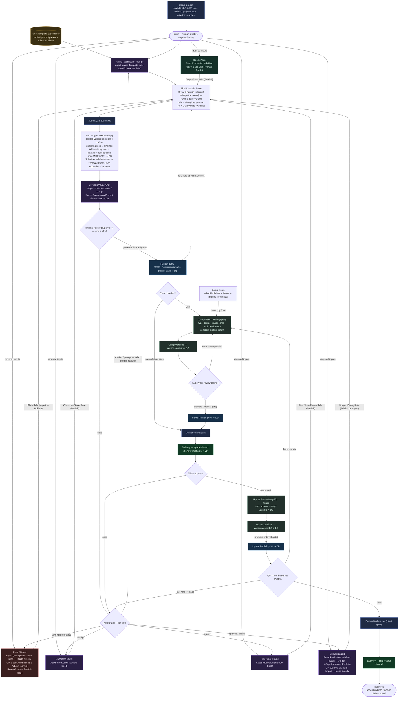
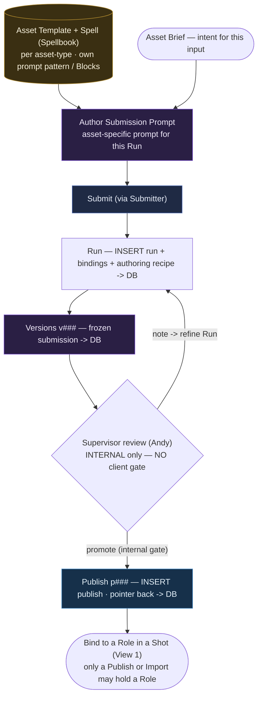
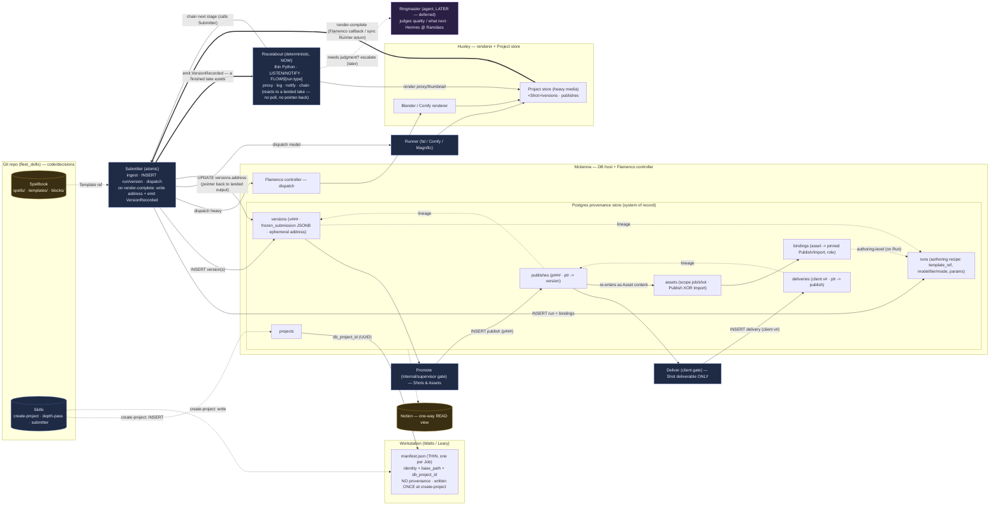

# PIPELINE.md — Fleet Production Pipeline (canon flowchart)

> Conforms to **CONTEXT.md** (ubiquitous language) and **ADR 0002–0016**. Ground-truth for Claude Code
> implementation. Read alongside `CONTEXT.md` and `HANDOFF.md`.
>
> Spine: **Submit → Run → Version (`v###`) → Publish (`p###`) → Delivery (client `v#`)**. Numbers
> **reset at each gate**; **lineage pointers** (not numbers) carry provenance (ADR 0005). The Manifest is
> **one per Job**, thin, and holds **no** provenance — all of it lives in **Postgres on Mckenna**
> (ADR 0006/0008).
>
> Three views: **View 1** main Shot flow (Brief → Delivery), **View 1b** the generalized Asset Production
> sub-flow (supervisor-only), **View 2** system/provenance (who writes what, when).

## Shapes & classes

- `([ ])` event/terminal · `[ ]` process/act · `{ }` review gate · `[( )]` datastore.
- **GenAI** = a Run that invokes a model · **Skill** = a hardened deterministic Skill (e.g. `depth-pass`) ·
  **Spell** = working-layer recipe/Template not yet graduated · **Import** = external input ·
  **Publish/Delivery** = gated artifacts · **sys** = Submitter / Roustabout / create-project.

## Key rules baked into the graph

- **Every gen step is the same loop:** author a Submission Prompt from a Spellbook **Template** →
  **Submit → Run → Version(s) → (review gate) → Publish**. The main Shot sweep adds a **second**, client
  gate (**Deliver**); **Assets do not** — they are **supervisor-approved only** (ADR 0005 audiences:
  Version=internal, Publish=supervisor, Delivery=client).
- **Only a Publish (internal) or an Import (external) may be bound to a Role — never a bare Version.**
  Internal assets (Character-Sheet, First/Last-Frame, Depth-Pass) must be **Published** first; external
  Imports (client plate, stock) bind directly.
- **Assets, like Shots, run the full Version→Publish loop and log all provenance to the DB** — each asset
  type has its **own Spell + Template + a Run-specific Submission Prompt**; every Version, Publish, and
  binding is written to Postgres on Mckenna.
- **No per-asset manifest.** The handoff to the next step is the **Publish pointer (`p###`) + DB resolve**;
  the manifest is one-per-Job (ADR 0006).

---

## View 1 — Main Shot Flow (Brief → Delivery)

> **Finish reading.** A **gen-AI video Publish** either delivers **as-is** or goes through a **Comp Run**
> (Nuke; `type: comp`, `versions/comp/`, `.nk` in `work/nuke/`) that combines multiple Publishes/Assets/
> Imports. Whatever is sent to the client crosses the **client gate** as a **Delivery** (the approval round
> is `v1`, revisions `v2…`). On approval, **Up-res** (`versions/upscale/`) → **QC** on the up-res Publish:
> **pass → Deliver** the final master (next client `v#`); **fail →** a **comp-fix** (back to the Comp Run)
> or a **note** routed to the corresponding upstream stage (video prompt revision, new first/last-frame,
> character-sheet, etc.). Comp and Up-res are themselves **Runs** through the Submitter — every Version and
> Publish logs to Postgres.

---

## View 1b — Asset Production sub-flow (generalized; supervisor-only)

Each internal Asset — **Character-Sheet**, **First/Last-Frame**, and **Lipsync-Dialog** (Spells), and
**Depth-Pass** (a hardened `depth-pass` Skill plus variant Spells like `depthcrafter-bw20`) — instantiates
this one loop. It is the
same Submit→Run→Version→Publish spine as a Shot, **minus the client gate**: an Asset is **approved by the
supervisor (Andy) only**, then its **Publish** is what gets bound into a Shot Role.

| Asset type | Maturity | Spellbook entry | Resulting Role |
|---|---|---|---|
| **Character-Sheet** | Spell (working layer) | own Template + Spell | Character-Sheet |
| **First / Last-Frame** | Spell (working layer) | own Template + Spell | First-Frame / Last-Frame |
| **Lipsync-Dialog** | Spell (working layer) | own Template + Spell (AI VO); sourced VO binds as an Import | Lipsync-Dialog |
| **Depth-Pass** | **Skill** (hardened spine) + variant Spells (`depthcrafter-bw20`, `depthcrafter-anyline-combo`) | spine in `skills/`, recipes in `spellbook/spells/` | Depth-Pass |

A Spell **graduates into a Skill** when invoked often enough (ADR 0001/0009) — that is why depth-pass is
already a Skill and the other two are not yet.

---

## View 2 — System / Provenance (who writes what, when)

### What gets written to Mckenna's DB, and when

| Moment | Writes to Postgres (Mckenna) | Manifest |
|---|---|---|
| **create-project** | `INSERT projects` → returns `db_project_id` (UUID) | written **once** (thin, one per Job); `db_project_id` stored |
| **Submit** (a Run — Shot / Asset / **Comp** / **Up-res**) | `INSERT runs` (authoring recipe: `template_ref`, `params`, type-specific **`spec`** (ADR 0016); `type` ∈ seed-sweep / prompt-variation / xy-plot / refine / **comp** / **upscale** / **depth-pass**) + `INSERT bindings` (all inputs asset→role, incl. `Source` / `Comp-Input`) + `INSERT versions` (Submitter **expands `spec`** → one per take; `stage` render/upscale/comp, `frozen_submission` JSONB, **`address` NULL** until the take lands) | untouched |
| **Render completes** (Flamenco callback / sync Runner return) → **Submitter** | `UPDATE versions.address` (pointer back to the landed output) → **emit `VersionRecorded`** (ADR 0013) | untouched |
| **`VersionRecorded`** → **Roustabout** | *(no version-row write)* renders proxy/thumbnail, logs, notifies, chains the next stage | untouched |
| **Promote** (internal/supervisor gate — Shots, Assets, Comp, Up-res) | `INSERT publishes` (`p###`, `source_version_id`) | untouched |
| **Deliver** (client gate — approval round **and** final master, each a Delivery) | `INSERT deliveries` (client `v#`, `source_publish_id`) | untouched |
| **Asset registered / re-resolved** | `INSERT/UPDATE assets` (Publish XOR Import) | untouched |

The **manifest is written once** at `create-project` (one per Job) and only rewritten on a breaking schema
change (`manifest_version` bump). It never holds Runs/Versions/Publishes/Deliveries — the
Episode/Sequence/Shot structure is discovered by **walking the deterministic ADR-0003 tree**, and all
provenance is in Postgres. **There is no per-asset manifest:** the handoff between steps is the
**Publish pointer + DB resolve**. Gate counters (`v###` / `p###` / client `v#`) are allocated by the
**writer (Submitter)**, never by a DB trigger; the DB does no orchestration. Crucially,
**`VersionRecorded` fires only after a take's output has landed and its `address` is persisted** — the
Submitter writes the address on render completion (a Flamenco-controller callback, or a synchronous
Runner's return), so the Roustabout always reacts to a real, addressable artifact and never has to poll
or write the pointer itself (ADR 0013). **Notion is a one-way read view**, never the source of truth.

### Spellbook & recipes (where craft lives, how it feeds back)

The **Spellbook** is a `spellbook/` folder in this repo (`spells/`, `templates/`, `templates/blocks/`),
distributed by Git (ADR 0009) — not Notion. A **Template** (verified prompt pattern, built from **Blocks**)
turns a **Brief** into a **Submission Prompt**; its reference is recorded as `runs.template_ref`. A
Template also declares its **knobs** — the param keys a Run's `spec` may sweep (`cfg`,
`lora.character.strength`, `seed`, …) and each knob's mapping to a Comfy node / API slot; the per-`run.type`
**spec** contract (xy-plot axes = knob + explicit values with N=points; seed/prompt/comp/upscale/depth
specs; all inputs via bindings) is **ADR 0016**. The
**recipe** is stored in two parts (ADR 0007): the **authoring** recipe once on the **Run**, and the
**frozen Submission Prompt + resolved params** per **Version** (immutable, self-reproducing — re-authoring
a Template can never invalidate an existing Version). Feedback loop: a method is first written as a
**Spell**; when invoked often enough it **graduates into a Skill** in `skills/`.

---

## Open / to-confirm (kept in sync with HANDOFF.md)

- **Episode token in the Shot code** — **resolved (ADR 0015):** included — `JOB_EP_SEQ_SHOT`
  (`AWA_EP01_SALEM_010`), because Sequence names recur across Episodes. Does not affect this flow's shape.
- **What a Template's "function" keys on** — **resolved:** a Template's function = **workflow-type/mode**
  (`t2v`/`i2v`/`r2v`, = `runs.mode`); a **Block's** function = **prompt-purpose** (camera/style/lighting/
  motion). Spellbook indexes Templates by model×mode, Blocks by model×purpose.
- **Roustabout `FLOWS[run.type]`** — exact deterministic flow per `run.type` (incl. `depth-pass` and the
  Asset Runs: proxy? contact-sheet? auto-publish?) is the next implementation grill (HANDOFF §OPEN 5).
